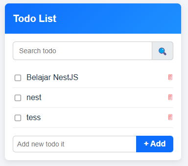

# React + TypeScript + Vite – Todo App



Simple Todo List App built with **React, TypeScript, and Vite**, integrated with Backend API.

---

## 🚀 Getting Started

### Prerequisites

Make sure you have installed:

- **Node.js** >= 18  
  Check version:
  ```bash
  node -v

Clone Repository

```bash

git clone <repository-url>
cd todo-fe
```

Install Dependencies

```bash
npm install
```

Run Development Server

```bash
npm run dev
```

The app will be available at:

```bash
http://localhost:5173
```